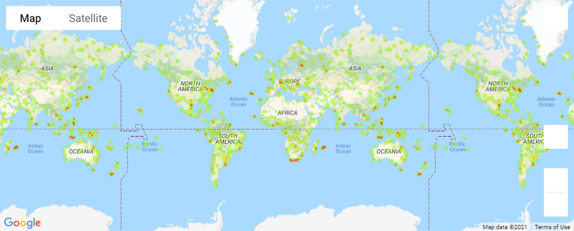
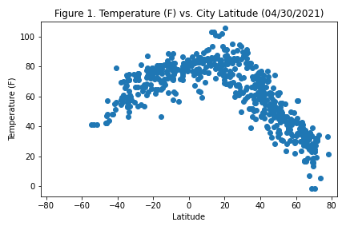
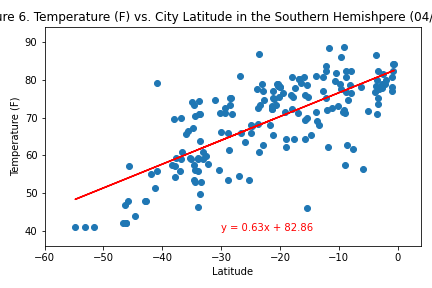

# World-Cities-Weather

Analysis of weather in cities across the globe with Python requests, APIs, and JSON. Created with Pandas and Matplotlib. Random city coordinates are generated and plotted with [citipy Python library](https://pypi.org/project/citipy/), the [OpenWeatherMap API](https://openweathermap.org/api), and [Google Places API](https://developers.google.com/maps/documentation/places/web-service/overview) to create a representative model of weather across world cities.

## WeatherPy

Python script to visualize the weather of 500+ cities across the world of varying distance from the equator.

## Humidity Heatmap

### WeatherPy Steps

- A series of scatter plots to showcase the following relationships:
  - Temperature (F) vs. Latitude
  - Humidity (%) vs. Latitude
  - Cloudiness (%) vs. Latitude
  - Wind Speed (mph) vs. Latitude

### Scatter Plot

- Perform linear regression on each relationship.
- Separate the plots into Northern and Southern Hemispheres.
- Temperature (F) vs. Latitude
  - Southern Hemisphere - Temperature (F) vs. Latitude
  - Northern Hemisphere - Humidity (%) vs. Latitude
  - Southern Hemisphere - Humidity (%) vs. Latitude
  - Northern Hemisphere - Cloudiness (%) vs. Latitude
  - Southern Hemisphere - Cloudiness (%) vs. Latitude
  - Northern Hemisphere - Wind Speed (mph) vs. Latitude
  - Southern Hemisphere - Wind Speed (mph) vs. Latitude
- Randomly select 500 unique cities based on latitude and longitude.
- Perform a weather check on each of the cities using a series of successive API calls.
- Include a print log of each city as it is being processed with the city number and city name.
- Save a CSV of all retrieved data and a PNG image for each scatter plot.

### Linear Regression

## VacationPy

Jupyter-gmaps and the [Google Places API](https://developers.google.com/maps/documentation/places/web-service/overview) to find the ideal place to vacation.

## Hotel Map

### VacationPy Steps

- Create a heat map that displays the humidity for every city.
- Find an ideal weather condition.
- Use Google Places API to find the first hotel for each city located within 5,000 meters of coordinates.
- Plot the hotels on top of the humidity heatmap with each pin containing the hotel name, city, and country.

## Data Source

- [OpenWeatherMap](https://openweathermap.org/)

## Resources

- [Citipy Python library](https://pypi.org/project/citipy/)
- [OpenWeatherMap](https://openweathermap.org/api)
- [Google Places API](https://developers.google.com/maps/documentation/places/web-service/overview)

## Authors

- **David W. Mueller**
  - [LinkedIn Profile](https://www.linkedin.com/in/davidwaltermueller/)
  - davemuelle@gmail.com

## Acknowledgments

- Michigan State University Data Analytics Bootcamp; April 30, 2021.
